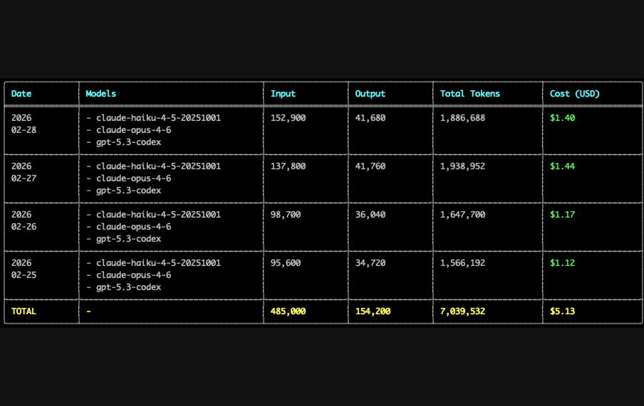

# tokenusage (`tu`)

Fast Rust CLI/TUI/GUI token usage tracker for Codex usage and Claude Code usage.

[](https://github.com/hanbu97/tokenusage/actions/workflows/ci.yml)
[](https://github.com/hanbu97/tokenusage/actions/workflows/release.yml)

`tu` scans local session logs and gives one merged token + cost view across Codex and Claude in CLI, live monitor, and GUI.

**Benchmark:** up to **131.1x faster than `ccusage`** on warm runs (**34.5x** on cold runs) with real local Codex logs. [See full benchmark](#benchmark-details).

## Screenshots

<table>
  <tr>
    <td width="50%" align="center" valign="top">
      
    </td>
    <td width="50%" align="center" valign="top">
      
    </td>
  </tr>
</table>

## Install

### cargo (crates.io)

```bash
cargo install tokenusage --bin tu
```

### npm

```bash
npm install -g tokenusage
```

### cargo-binstall (prebuilt binary)

```bash
cargo binstall tokenusage --no-confirm
```

## Quick Start

```bash
tu
tu live
tu gui
```

## Why tokenusage

- Faster feedback loop: native Rust + parallel scan/parsing + incremental cache.
- One dashboard for both Codex and Claude, with merged totals and per-model breakdown.
- Works in terminal and desktop GUI without sending your logs to a cloud service.

## FAQ

### Where does the data come from?

From local log directories only:
- Claude: `~/.config/claude/projects`, `~/.claude/projects`
- Codex: `~/.codex/sessions`, `~/.config/codex/sessions`

You can override with `--claude-projects-dir` and `--codex-sessions-dir`.

### How is cost estimated?

`tu` uses OpenRouter pricing when available, caches it for 6 hours, and falls back to built-in offline rates when network pricing is unavailable.

### Is my data private?

Yes for usage logs: parsing is local. `tu` only requests pricing metadata unless you run `--offline`.

## Benchmark Details

Benchmark setup:

- Machine: Apple M3 Max, macOS 15.6.1
- Dataset: `~/.codex/sessions` (71 JSONL files, ~537 MB), date range `2025-09-01` to `2026-02-28`
- `tu` version: `1.1.2`
- `@ccusage/codex` version: `18.0.8`
- Both in default mode (online pricing behavior, network enabled)

Results:

| Tool | Command | Time |
|---|---|---:|
| `tu` (cold, rebuild cache) | `tu codex --rebuild-cache -s 2025-09-01 -u 2026-02-28` | **0.19s** |
| `@ccusage/codex` (single run) | `ccusage-codex daily -s 2025-09-01 -u 2026-02-28` | **6.56s** |
| `tu` (warm, avg of 10 runs) | `tu codex -s 2025-09-01 -u 2026-02-28` | **0.052s** |
| `@ccusage/codex` (warm, avg of 10 runs) | `ccusage-codex daily -s 2025-09-01 -u 2026-02-28` | **6.819s** |

- Cold-run speedup: about **34.5x**
- Warm-run speedup: about **131.1x**

> Notes: results vary by hardware, filesystem cache state, and log volume.

## Command Overview

```text
tu [daily|codex|claude|monthly|weekly|session|blocks|live|statusline|gui]
```

Useful commands:
- `tu daily --tui`
- `tu daily --json`
- `tu daily --jq '.rows[0]'`
- `tu blocks --active`
- `tu blocks --live`
- `tu live`
- `tu statusline`

## Config File

Config search order:
1. `./.tu/tu.json`
2. `~/.config/tu/tu.json`
3. `~/.config/tokenusage/tokenusage.json`

Use an explicit config file:

```bash
tu --config /path/to/tu.json
```

Example:

```json
{
  "defaults": {
    "timezone": "Asia/Shanghai",
    "workers": 16,
    "compact": false
  },
  "commands": {
    "daily": {
      "instances": true
    },
    "live": {
      "sessionLength": 5,
      "refreshInterval": 1
    },
    "weekly": {
      "startOfWeek": "monday"
    }
  }
}
```

## Pricing

```bash
tu --pricing-file ./pricing.json
```

Offline-only mode:

```bash
tu --offline
```

## Demo Dataset (No Real Data)

```bash
python3 examples/demo/generate_demo_data.py
tu daily --config ./examples/demo/tu.demo.json --since 2026-02-09 --until 2026-02-28
tu live --config ./examples/demo/tu.demo.json
tu gui --config ./examples/demo/tu.demo.json --since 2026-02-09 --until 2026-02-28
```

## Development

```bash
cargo fmt
cargo clippy --all-targets --all-features
cargo check
```

## License

MIT. See [LICENSE](./LICENSE).
