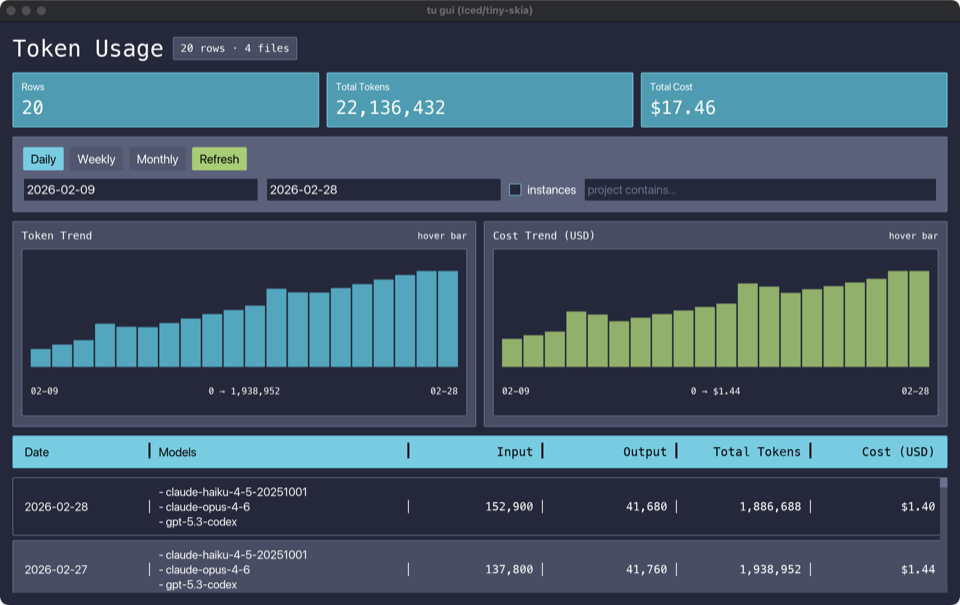
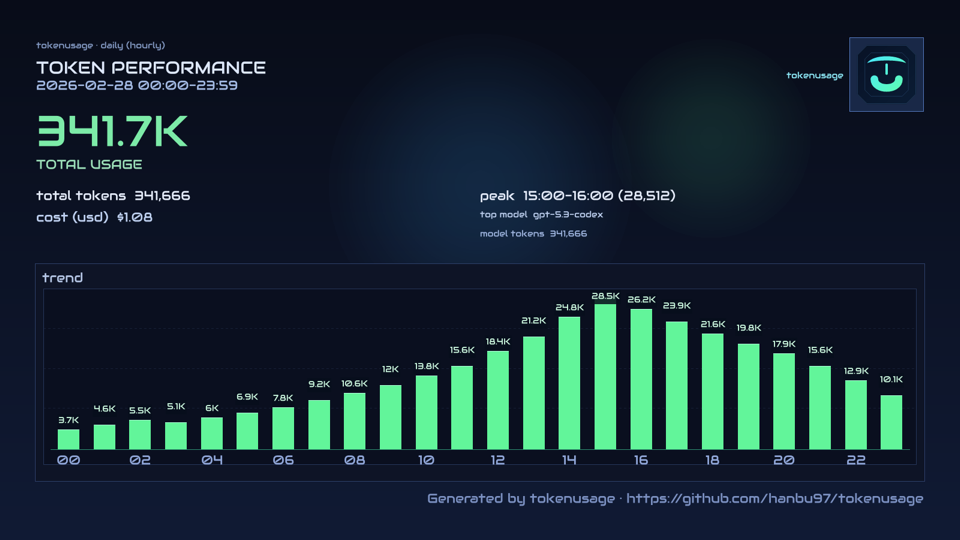
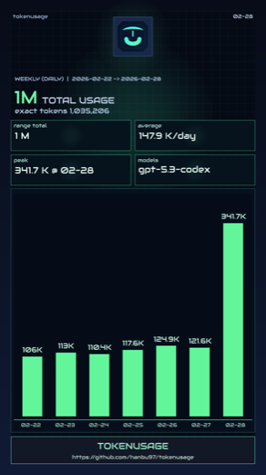
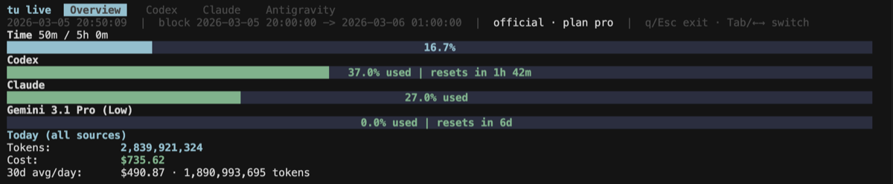

<p align="center">
  
</p>

<h1 align="center">tokenusage</h1>

<p align="center">
  <strong>Stop getting throttled without warning. Know your AI coding costs in 0.08s.</strong>
</p>

<p align="center">
  <a href="https://github.com/hanbu97/tokenusage/actions/workflows/ci.yml"></a>
  <a href="https://github.com/hanbu97/tokenusage/actions/workflows/release.yml"></a>
  <a href="https://crates.io/crates/tokenusage"></a>
  <a href="https://www.npmjs.com/package/tokenusage"></a>
  <a href="https://pypi.org/project/tokenusage/"></a>
  <a href="./LICENSE"></a>
</p>

<p align="center">
  English | <a href="./README.zh-cn.md">中文</a>
</p>

---

### Install in one line

```bash
npm i -g tokenusage        # or: cargo install tokenusage --bin tu
```

### Run it

```bash
tu                          # daily cost report in 0.08s
```

---

<p align="center">
  <strong>214x faster</strong> than ccusage on Claude logs · <strong>138x faster</strong> on Codex logs · <a href="#benchmark-details">See benchmark</a>
</p>

<p align="center">
  If <code>tokenusage</code> saves you time, <a href="https://github.com/hanbu97/tokenusage">give it a star</a> — it directly helps other Codex and Claude users find it.
</p>

---

## Screenshots

<table align="center" width="100%">
  <tr>
    <td valign="top" width="50%">
      <code>tu</code> — daily report<br/>
      <p align="center">
        <a href="docs/images/cli-demo-padded.png"></a>
      </p>
    </td>
    <td valign="top" width="50%">
      <code>tu gui</code> — desktop dashboard<br/>
      <p align="center">
        <a href="docs/images/gui-demo.png"></a>
      </p>
    </td>
  </tr>
  <tr>
    <td valign="top" width="50%">
      <code>tu img day</code> — shareable card<br/>
      <p align="center">
        <a href="docs/images/share-demo.png"></a>
      </p>
    </td>
    <td valign="top" width="50%">
      <code>tu img week</code> — weekly card<br/>
      <p align="center">
        <a href="docs/images/share-week-demo.png"></a>
      </p>
    </td>
  </tr>
  <tr>
    <td valign="top" colspan="2">
      <code>tu live</code> — real-time TUI monitor<br/>
      <p align="center">
        <a href="docs/images/live-demo.png"></a>
      </p>
    </td>
  </tr>
</table>

## Why tokenusage

| Problem | tokenusage solution |
|---|---|
| Hit rate limits mid-refactor, no warning | `tu live` shows usage in real-time |
| No idea what AI coding costs per day | `tu` gives daily cost breakdown in 0.08s |
| Codex / Claude / Gemini / OpenCode logs in separate places | One merged dashboard across all sources |
| Existing tools are slow on large logs | 214x faster than ccusage (Rust + parallel scan + cache) |
| Don't want to upload logs to a cloud | 100% local parsing, no data leaves your machine |
| Want coding-time context, not just raw tokens | `tu` keeps the classic token table by default; `--with-activity` opt-in adds coding time and tokens/hour |
| Want to share usage stats | `tu img` generates shareable image cards |

## Install

### npm (recommended)

```bash
npm install -g tokenusage
```

### cargo (crates.io)

```bash
cargo install tokenusage --bin tu
```

### pip (PyPI)

```bash
pip install tokenusage
```

### cargo-binstall (prebuilt binary)

```bash
cargo binstall tokenusage --no-confirm
```

## Quick Start

```bash
# Daily report (default)
tu                          # classic merged token report
tu --tui                    # same report in terminal UI

# Source-specific
tu codex
tu claude
tu gemini
tu opencode
tu antigravity

# Date filter
tu --since 2026-02-01 --until 2026-02-28

# Weekly / monthly
tu weekly --start-of-week monday
tu monthly

# Native time views inferred from local AI usage
tu today
tu activity
tu activity --days 14
tu activity --project tokenusage

# Add locally inferred coding activity columns (Coding / Tok/hr)
tu --with-activity
tu --with-activity --tui
tu live --with-activity

# Native local heartbeat collector
tu heartbeat watch .
tu heartbeat stats
tu heartbeat ping src/main.rs --write

# Live monitor (tabs: Codex / Claude / Antigravity)
tu live
tu live codex
tu live claude
tu live antigravity

# Real-time per-session viewer (htop for tokens)
tu top
tu top --active-hours 12    # show sessions active in last 12h
tu top --active-hours 0     # show all sessions

# GUI dashboard
tu gui

# Share image card (for social posting)
tu img
tu img day
tu img week
```

### Data locations (defaults)

- Claude Code: `~/.claude/projects` (override with `--claude-projects-dir`)
- Codex CLI: `$CODEX_HOME/sessions` (fallback `~/.codex/sessions`, override with `--codex-sessions-dir`)
- Gemini CLI: `~/.gemini/tmp` (override with `--gemini-data-dir`)
- OpenCode: `$OPENCODE_DATA_DIR` or `$XDG_DATA_HOME/opencode` (fallback `~/.local/share/opencode`, override with `--opencode-data-dir`)

## Benchmark Details

**Setup:**

- Machine: Apple M3 Max, macOS 15.6.1
- `tu` version: `1.2.6` · `ccusage` version: `18.0.8` · `@ccusage/codex` version: `18.0.8`
- Default mode (no date filters, online pricing, network enabled)

**Codex** — 91 JSONL files, 1.7 GB (`~/.codex/sessions`)

| | `tu codex` | `bunx @ccusage/codex` | Speedup |
|---|---:|---:|---:|
| Cold (rebuild cache) | **0.92s** | 20.76s | **22.6x** |
| Warm (best of 5 / avg of 3) | **0.15s** | 20.76s | **138x** |

**Claude** — 1 521 JSONL files, 2.2 GB (`~/.claude/projects`)

| | `tu claude` | `bunx ccusage` | Speedup |
|---|---:|---:|---:|
| Cold (rebuild cache) | **0.73s** | 17.15s | **23.5x** |
| Warm (best of 5 / avg of 3) | **0.08s** | 17.15s | **214x** |

> Results vary by hardware, filesystem cache state, and log volume.

For a detailed feature comparison, see [tokenusage vs ccusage](docs/compare/tokenusage-vs-ccusage.md).

## FAQ

### Where does the data come from?

From local log directories and IDE probes:
- Claude: `~/.config/claude/projects`, `~/.claude/projects`
- Codex: `~/.codex/sessions`, `~/.config/codex/sessions`
- Antigravity: probed from running IDE language server (no log files needed)

You can override with `--claude-projects-dir` and `--codex-sessions-dir`.

### How is cost estimated?

`tu` uses OpenRouter pricing when available, caches it for 6 hours, and falls back to built-in offline rates when network pricing is unavailable.

### How does `--with-activity` work?

`tu` infers coding activity locally from your machine. By default it clusters nearby AI usage events into active windows. If you enable the native heartbeat collector (`tu heartbeat watch ...`), `tu` will prefer heartbeat-backed activity on days with sufficient heartbeat coverage and fall back to token-event inference elsewhere.

From that local activity signal, `tu` derives:

- coding time
- tokens per coding hour
- cost per coding hour
- project / language / source breakdowns

The dedicated time views (`tu today`, `tu activity`) enable this automatically. `--with-activity` adds the same local activity context to daily/weekly/monthly reports and `tu live`.

By default, `tu` keeps the original merged token report layout. The extra `Coding` / `Tok/hr` columns only appear when activity context is explicitly enabled with `--with-activity`, or when you use the dedicated time views.

### Is my data private?

Yes for usage logs: parsing is local. `tu` only requests pricing metadata unless you run `--offline`.

## Command Overview

```text
tu [daily|today|activity|heartbeat|codex|claude|antigravity|monthly|weekly|img|session|blocks|live|top|statusline|gui]
```

Useful commands:
- `tu --tui`
- `tu --with-activity --tui`
- `tu daily --tui`
- `tu daily --json`
- `tu daily --jq '.rows[0]'`
- `tu today`
- `tu activity --days 14`
- `tu heartbeat watch .`
- `tu heartbeat stats`
- `tu blocks --active`
- `tu blocks --live`
- `tu live`
- `tu img --output tokenusage-share.png` (today, hourly)
- `tu img --period weekly --output tokenusage-week.png` (7 days, daily)
- `tu img --logo ./logo.png --brand-url tokenusage.dev`
- `tu statusline`

## Config File

Config search order:
1. `./.tu/tu.json`
2. `~/.config/tu/tu.json`
3. `~/.config/tokenusage/tokenusage.json`

Use an explicit config file:

```bash
tu --config /path/to/tu.json
```

Example:

```json
{
  "defaults": {
    "timezone": "Asia/Shanghai",
    "workers": 16,
    "compact": false
  },
  "commands": {
    "daily": {
      "instances": true
    },
    "live": {
      "sessionLength": 5,
      "refreshInterval": 1
    },
    "img": {
      "period": "daily",
      "bars": 24,
      "brand": "tokenusage",
      "brandUrl": "https://github.com/hanbu97/tokenusage"
    },
    "weekly": {
      "startOfWeek": "monday"
    }
  }
}
```

## Pricing

```bash
tu --pricing-file ./pricing.json
```

Offline-only mode:

```bash
tu --offline
```

## Demo Dataset (No Real Data)

```bash
python3 examples/demo/generate_demo_data.py
tu daily --config ./examples/demo/tu.demo.json --since 2026-02-09 --until 2026-02-28
tu live --config ./examples/demo/tu.demo.json
tu gui --config ./examples/demo/tu.demo.json --since 2026-02-09 --until 2026-02-28
tu img --config ./examples/demo/tu.demo.json --since 2026-02-28 --until 2026-02-28 --output ./docs/images/share-demo.png
tu img --config ./examples/demo/tu.demo.json --period weekly --since 2026-02-22 --until 2026-02-28 --output ./docs/images/share-week-demo.png
```

## Development

```bash
cargo fmt
cargo clippy --all-targets --all-features
cargo check
```

## License

MIT. See [LICENSE](./LICENSE).
