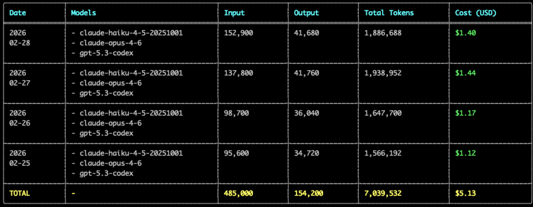
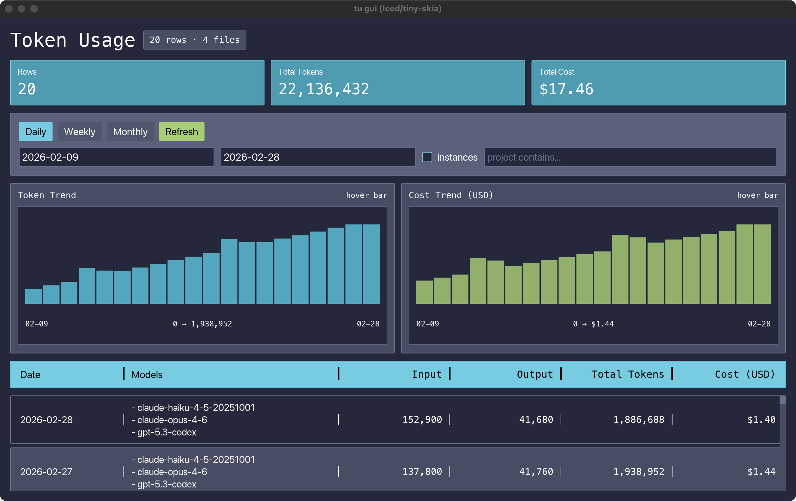

# tokenusage (`tu`)

Blazing-fast **Rust** token usage tracker for **Claude Code** and **Codex**.

[](https://github.com/hanbu97/tokenusage/actions/workflows/ci.yml)
[](https://github.com/hanbu97/tokenusage/actions/workflows/release.yml)

`tu` scans local session logs, merges multiple sources, estimates cost, and shows results in:
- CLI table (responsive columns)
- TUI (sticky header + scroll)
- GUI (`iced` + `tiny-skia`)
- Live session monitor with progress bars

## Why `tu`

- **Real-world speedup vs `ccusage`**: about **34.5x (cold)** and **131.1x (warm)** on local Codex logs
- **Why it is faster**: native Rust startup, parallel file discovery/parsing, and incremental cache reuse
- **One report for both Codex + Claude** (merged totals and merged model view)
- Also supports source-specific modes: `tu codex`, `tu claude`, `tu live codex`, `tu live claude`

This project is built for people searching for:
**Claude Code usage tracker**, **Codex usage monitor**, **LLM token cost dashboard**, **Rust TUI/GUI token analytics**.

## Screenshots

<table>
  <tr>
    <td align="center" valign="middle" width="44%">
      
    </td>
    <td align="center" valign="middle" width="56%">
      
    </td>
  </tr>
</table>

## Install

### cargo (crates.io)

```bash
cargo install tokenusage --bin tu
```

### Homebrew

```bash
brew tap hanbu97/tap
brew install tu
```

### npm

```bash
npm install -g tokenusage
```

### From source

```bash
cargo install --path . --bin tu --force
```

## Quick Start

```bash
# Run daily report (default command)
tu

# Only Codex / only Claude
tu codex
tu claude

# Date filter
tu --since 2026-02-01 --until 2026-02-28

# Weekly / monthly
tu weekly --start-of-week monday
tu monthly

# Live block monitor
tu live
tu live codex
tu live claude

# GUI dashboard
tu gui
```

## Benchmark Details (Real Local Data, Codex-Only)

Benchmark setup:

- Machine: Apple M3 Max, macOS 15.6.1
- Dataset: `~/.codex/sessions` (71 JSONL files, ~537 MB), date range `2025-09-01` to `2026-02-28`
- `tu` version: `1.1.0`
- `@ccusage/codex` version: `18.0.8`
- Both in default mode (online pricing behavior, network enabled)

Results:

| Tool | Command | Time |
|---|---|---:|
| `tu` (cold, rebuild cache) | `tu codex --rebuild-cache -s 2025-09-01 -u 2026-02-28` | **0.19s** |
| `@ccusage/codex` (single run) | `ccusage-codex daily -s 2025-09-01 -u 2026-02-28` | **6.56s** |
| `tu` (warm, avg of 10 runs) | `tu codex -s 2025-09-01 -u 2026-02-28` | **0.052s** |
| `@ccusage/codex` (warm, avg of 10 runs) | `ccusage-codex daily -s 2025-09-01 -u 2026-02-28` | **6.819s** |

- Cold-run speedup: about **34.5x**
- Warm-run speedup: about **131.1x**

> Notes: results vary by hardware, filesystem cache state, and log volume.

## Demo Dataset (No Real Data)

Use the bundled mock dataset when you want screenshots/demos without exposing local usage logs.

```bash
# regenerate demo logs
python3 examples/demo/generate_demo_data.py

# run reports with demo-only config
tu daily --config ./examples/demo/tu.demo.json --since 2026-02-09 --until 2026-02-28
tu live --config ./examples/demo/tu.demo.json
tu gui --config ./examples/demo/tu.demo.json --since 2026-02-09 --until 2026-02-28
```

## What `tu` Tracks

- Input tokens
- Output tokens
- Cache create tokens
- Cache read tokens
- Total tokens
- Estimated cost (USD)
- Per-model merged view (`claude-haiku-...`, `gpt-5.3-codex`, etc.)

## Data Sources

By default, `tu` checks these directories and merges all valid logs:

- Claude:
  - `~/.config/claude/projects`
  - `~/.claude/projects`
- Codex:
  - `~/.codex/sessions`
  - `~/.config/codex/sessions`

You can override with:
- `--claude-projects-dir <PATH>` (repeatable)
- `--codex-sessions-dir <PATH>` (repeatable)

This merged mode is the key difference from single-source tools: one timeline/table can include both providers, while still allowing per-source commands when needed.

## Command Overview

```text
tu [daily|codex|claude|monthly|weekly|session|blocks|live|statusline|gui]
```

Useful commands:
- `tu daily --tui`: terminal table UI with sticky header
- `tu daily --json`
- `tu daily --jq '.rows[0]'`
- `tu blocks --active`
- `tu blocks --live`
- `tu live`: same intent as live block monitor
- `tu statusline`: statusline output (cache-aware)

## Config File

Config search order:
1. `./.tu/tu.json`
2. `~/.config/tu/tu.json`
3. `~/.config/tokenusage/tokenusage.json`

You can also pass explicit config:

```bash
tu --config /path/to/tu.json
```

Example:

```json
{
  "defaults": {
    "timezone": "Asia/Shanghai",
    "workers": 16,
    "compact": false
  },
  "commands": {
    "daily": {
      "instances": true
    },
    "live": {
      "sessionLength": 5,
      "refreshInterval": 1
    },
    "weekly": {
      "startOfWeek": "monday"
    }
  }
}
```

## Pricing

- Uses OpenRouter model pricing when available.
- Pricing cache TTL: **6 hours**.
- Falls back to built-in offline rate table if network data is unavailable.
- Optional override file:

```bash
tu --pricing-file ./pricing.json
```

Use offline-only mode:

```bash
tu --offline
```

## Performance Notes

- Parallel file discovery via `ignore` crate
- Parallel parsing with `rayon` + worker threads + channels
- Incremental parse cache for repeated runs

Built-in heavy directory ignores include: `.git`, `node_modules`, `target`, `dist`, `build`, `.cache`, `venv`...

## Troubleshooting

- If no data appears, pass explicit roots:
  - `--claude-projects-dir ...`
  - `--codex-sessions-dir ...`
- If your terminal is narrow, `tu` auto-switches to compact columns.
- Use `--debug` to print parser stats.

## Development

```bash
cargo fmt
cargo clippy --all-targets --all-features
cargo check
```

## Release (Maintainers)

Tag-based release is enabled in GitHub Actions (`.github/workflows/release.yml`).

On tag push (`vX.Y.Z`), the pipeline:
- builds and uploads release assets (Linux/macOS/Windows)
- publishes GitHub Release
- publishes to crates.io and npm (release fails if tokens are missing)
- optionally updates Homebrew tap formula (if configured)

Required repository secrets for full multi-channel publish:
- `CRATES_IO_TOKEN`
- `NPM_TOKEN`
- `HOMEBREW_TAP_PAT`

If `CRATES_IO_TOKEN` or `NPM_TOKEN` is missing, the tagged release job fails to prevent partial publish.

Homebrew tap target repo defaults to:
- `hanbu97/homebrew-tap` (tap name: `hanbu97/tap`)

```bash
git tag v1.1.0
git push origin v1.1.0
```

Version sync requirement before tagging:
- `Cargo.toml` `package.version` must equal tag without `v`
- `npm/tu/package.json` `version` must equal tag without `v`

## License

MIT. See [LICENSE](./LICENSE).
