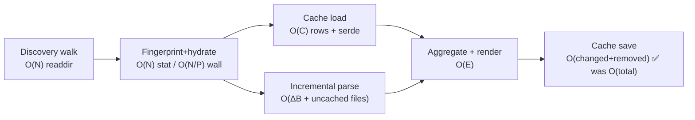
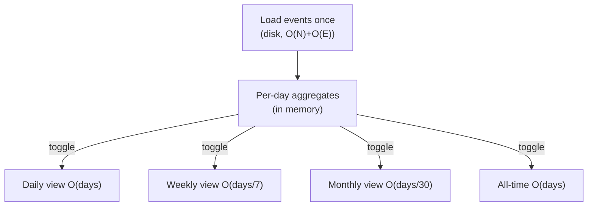

# tu — Scaling, Migration & UX Design Notes

Working notes (2026-06-11) after the 1.6.0 perf/UX pass. Captures the cost model,
remaining optimisation ideas, migration robustness, and a persona-driven UX
critique. Not a spec — a backlog with reasoning.

## 1. Per-run cost model (big-O)

Let:
- **N** = total transcript files discovered (~19.6k now, grows ~unboundedly)
- **C** = cached file entries (~1.9k now — note the gap vs N, see §2a)
- **E** = total events aggregated into the report
- **ΔB** = bytes appended to existing files since last run
- **P** = cores

Fixed in 1.6.0: the **save** term (was a ~60 MB JSON rewrite *every dirty run* →
now incremental row upserts) and the **fingerprint/hydrate** pass (was serial →
now `O(N/P)`).

Still **O(N)** and **O(E)** per run, growing with history forever: the discovery
walk, the cache load, and the aggregation fold.

## 2. Remaining optimisations (ranked by leverage ÷ effort)

### a. Negative caching — *small effort, possibly large win*
`doctor` shows **entries ≈ 1.9k but discovered ≈ 19.6k**. The ~17k files with no
usage events likely have **no cache entry**, so they're re-opened and Full-parsed
on *every* run. Fix: store an empty `CachedFileEntry` (events: []) for files that
yield zero events, so their fingerprint hits the cache and they're skipped.
Verify the hypothesis first with a parse-count probe.

### b. Window-pruning for dated queries — *medium effort, biggest win for the hot path*
`tu today` / `tu statusline` / `tu --since X` still discover + stat + load **all
N files** even though only files modified within the window can contain in-window
events. A file with `mtime < window_start` **cannot** hold events in the window →
skip it entirely. Turns the constant-running `statusline`/`today` path from O(N)
into O(files-in-window). This is the highest-value scaling change because those
commands run far more often than `monthly`/all-time.

### c. Incremental aggregation cache — *medium/large effort*
`monthly`/all-time re-fold **E** events every run. Cache per-day rolled-up totals
keyed by date; recompute only days whose files changed. O(E) → O(ΔE + days).

### d. Persistent index / watch daemon — *large effort, removes the O(N) floor*
Maintain a live file index + hot aggregate via a filesystem watcher (the
heartbeat watcher infra already exists). Interactive runs skip the cold walk
entirely. Biggest architectural win; most code.

### e. Compact entry encoding — *medium effort*
DB is ~67 MB (vs 62 MB JSON) because each row stores entry JSON as TEXT. A binary
encoding (bincode/msgpack blob) would shrink size and cut per-row deserialize on
load. Also lets `load` lazy-fetch only discovered keys instead of SELECT-all.

### f. Parallel discovery walk — *small/medium*
If `ignore::WalkBuilder` runs serially within a root, switch to `build_parallel()`.

**Suggested order:** (a) verify+fix negative cache → (b) window-pruning → (c)
daily-aggregate cache → defer (d)/(e)/(f).

## 3. Migration robustness (upgrade paths)

| Scenario | Behaviour | Verdict |
|---|---|---|
| v2.json user → 1.6.0 | first run imports JSON→`v3.db`, deletes JSON (~16 s once) | ✅ |
| Crash mid-import | import is one transaction → rolls back, JSON kept, retried next run | ✅ |
| Crash after commit, before JSON delete | next run sees non-empty DB → skips import → deletes JSON | ✅ |
| Fresh user (no JSON) | builds DB from scratch | ✅ |
| Entry-schema bump (meta `version` 4→5) | load detects mismatch → clears DB → full reparse | ✅ |
| Pricing change | `pricing_key` mismatch → clears DB → full reparse | ✅ (pre-existing semantics) |
| Concurrent tu procs (statusline+top+interactive) | WAL + `busy_timeout(5s)` | ✅ reasonable |
| **Downgrade** (run old 1.5.x after 1.6.0) | old binary rebuilds its own v2.json; new binary later ignores it (DB populated) but leaves it as a stray file | ⚠ minor — polish: delete stray v2.json even when DB populated |
| **Corrupt DB** | load falls back to empty (cache disabled that run); keeps failing | ⚠ minor — polish: on open failure, delete+recreate the file |

Naming convention to keep: **filename `parse-cache-vN.db`** = storage-format
generation; **meta `version`** = entry-schema generation. Bump the filename only
when the *storage* layout breaks; bump meta `version` for entry-shape changes.

## 4. UX critique via personas

### Priya — cost-anxious solo dev
Runs `tu` a few times/day: "am I burning too much?" Wants a **one-line headline**
(today vs yesterday, month-to-date + projection), not a dense table + a 12-segment
insights line. → add a `--brief` one-liner and lead default output with a headline.

### Marcus — agent-platform engineer (power user, lives in `tu top`/`live`)
Toggles today/week/month to hunt spikes, drills into projects/models.
**Pain he named:** toggling time scales **re-runs the whole pipeline** (re-discover,
re-load, re-aggregate) each time. → see §5.

### Dana — eng manager / FinOps
`tu monthly --json` → dashboard; wants **period-over-period deltas** ("month +18%
vs last"), budgets/thresholds, exports (`tu img` already exists).

### "CI" — automation
`tu doctor --json`, `tu statusline` in scripts. Wants **non-zero exit on problems**
(warnings exist but don't affect exit code) and speed (§2b).

### Cross-cutting UX backlog
1. **Parse-once, re-bucket-many** (§5) — biggest interactive win.
2. **Window-pruning** (§2b) — biggest automation/`today` win.
3. **Headline-first / progressive disclosure** — lead with the number each persona wants.
4. **Period-over-period deltas** on every report (▲/▼ vs previous comparable period) — cheap, high value.
5. **Drill-down / pivot in TUI** — toggle grouping (project/model/day/session) without reload.
6. **Exit codes + `--json` everywhere** for automation.
7. **Run-rate projection + optional budget** — "projected $X by month-end (budget $Y, ⚠ 87%)".

## 5. Time-scale toggle caching (the key interactive optimisation)

Today, switching daily↔weekly↔monthly re-runs discovery + load + aggregate. But
the **event set is identical across scales — only the date-bucketing differs.**

Design: in the TUI/GUI, load events **once** into memory, then on a scale toggle
just re-run the in-memory `O(E)` aggregation. Better still, precompute **per-day
aggregates once**; then week = Σ7 days, month = Σ~30 days, all-time = Σ all days —
each toggle becomes **O(days)**, effectively instant.

The GUI already caches *rendered reports per view*; this goes one level deeper —
cache the **events / day-buckets**, so even the first view of each scale is instant
after the initial load, and it composes with the daily-aggregate cache (§2c) for
cross-run persistence.
